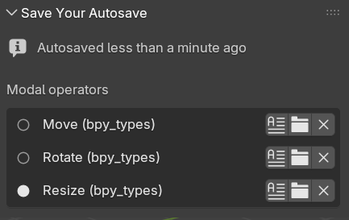

# Save Your Autosave

You can find it in the 3D viewport's "View" tab.

It displays the last time autosave occurred for the current session. This will help to see that active modal operators delay autosave.

It will also display a history of modal operators, with the following 3 buttons:

- open the modal operator's file in Blender text editor
- open folder containing the file
- remove operator from list (this does *not* cancel the modal operator or unregister it. It just removes it from the history)